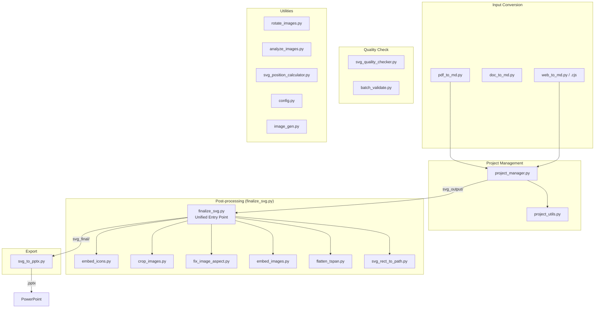

# PPT Master Toolset

This directory contains utility tools for project management, validation, and file processing.

## Tool Architecture Overview



### Core Workflow

```
Source Document → [pdf_to_md / doc_to_md / web_to_md] → Markdown
                    ↓
              [project_manager init]
                    ↓
              AI generates SVG → svg_output/
                    ↓
              [finalize_svg] ← Aggregates 6 sub-tools
                    ↓
              svg_final/
                    ↓
              [svg_to_pptx] → output.pptx
```

### Tool Category Quick Index

| Category | Tool | Description |
|----------|------|-------------|
| **Input Conversion** | `pdf_to_md.py`, `doc_to_md.py`, `web_to_md.py/.cjs` | Convert PDF/DOCX/web pages to Markdown |
| **Project Management** | `project_manager.py` | Create and validate projects |
| **Post-processing** | `finalize_svg.py` ⭐ | Unified entry point, invokes the 6 tools below |
| ↳ Sub-tool | `embed_icons.py` | Embed icon placeholders |
| ↳ Sub-tool | `crop_images.py` | Smart image cropping |
| ↳ Sub-tool | `fix_image_aspect.py` | Fix image aspect ratio |
| ↳ Sub-tool | `embed_images.py` | Base64 image embedding |
| ↳ Sub-tool | `flatten_tspan.py` | Text flattening |
| ↳ Sub-tool | `svg_rect_to_path.py` | Rounded rect to Path |
| **Export** | `svg_to_pptx.py` | SVG to PowerPoint |
| **Speaker Notes** | `total_md_split.py` | Speaker notes splitter |
| **Quality Check** | `svg_quality_checker.py`, `batch_validate.py` | Validate SVG compliance |
| **Asset Generation** | `image_gen.py` | AI image generation (Gemini / OpenAI) |
| **Utilities** | `config.py`, `analyze_images.py`, `rotate_images.py` | Configuration and image processing |

---

## Tool List

### 0. pdf_to_md.py — PDF to Markdown Tool (Recommended First Choice)

Uses PyMuPDF to convert PDF documents to Markdown format. Runs locally, fast, and free.

**Features**:

- Extract PDF text content and convert to Markdown
- Automatically extract tables and convert to Markdown tables
- Automatically extract images and save to `images/` directory
- Support batch processing of all PDFs in a directory

**Usage**:

```bash
# Convert a single file
python3 scripts/pdf_to_md.py book.pdf

# Specify output file
python3 scripts/pdf_to_md.py book.pdf -o output.md

# Convert all PDFs in a directory
python3 scripts/pdf_to_md.py ./pdfs

# Specify output directory
python3 scripts/pdf_to_md.py ./pdfs -o ./markdown
```

**When to use pdf_to_md.py vs MinerU**:

| Scenario | Recommended Tool | Reason |
|----------|------------------|--------|
| **Native PDF** (exported from Word/LaTeX) | `pdf_to_md.py` | Local, instant, free |
| **Simple tables** | `pdf_to_md.py` | Table extraction supported |
| **Privacy-sensitive documents** | `pdf_to_md.py` | Data stays on your machine |
| **Scanned/image PDFs** | MinerU | OCR required |
| **Complex multi-column layouts** | MinerU | Better layout analysis |
| **Math formulas** | MinerU | Stronger AI recognition |
| **Garbled PDFs** (encoding lost) | MinerU | Visual recognition as fallback |

> **Strategy**: PyMuPDF first, MinerU as fallback. Run `pdf_to_md.py` first; if the result is garbled/blank/misformatted, switch to MinerU.

**Dependencies**:

```bash
pip install PyMuPDF
```

---

### 0.3. doc_to_md.py — Document to Markdown Tool (Pandoc-based)

Uses Pandoc to convert various document formats to Markdown. Ideal for converting DOCX lecture notes, manuscripts, and other documents.

**Supported formats**: `.docx`, `.doc`, `.odt`, `.rtf`, `.epub`, `.html`, `.tex`, `.rst`, `.org`, `.ipynb`, `.typ`

**Usage**:

```bash
# Convert a Word document
python3 scripts/doc_to_md.py lecture.docx

# Specify output file
python3 scripts/doc_to_md.py lecture.docx -o output.md

# Convert other formats
python3 scripts/doc_to_md.py notes.epub
python3 scripts/doc_to_md.py paper.tex -o paper.md
```

**Dependencies**:

```bash
# Install pandoc (required)
# macOS:   brew install pandoc
# Ubuntu:  sudo apt install pandoc
# Windows: https://pandoc.org/installing.html
```

---

### 0.5. web_to_md.py / web_to_md.cjs — Web Page to Markdown Tool

Scrapes web page content and converts it to Markdown format, automatically downloading images locally.

**Note**: Both Python and Node.js versions are provided. For sites with TLS fingerprint blocking such as WeChat Official Accounts, **the Node.js version is strongly recommended** (`web_to_md.cjs`).

**Features**:

- Scrape web page content and convert to Markdown
- Automatically extract page metadata (title, date, author)
- Automatically download images and save to `_files/` directory
- **Automatic filename cleanup** (retains only alphanumeric characters, Chinese characters, and underscores for maximum compatibility)
- Smart main content area detection (supports Chinese news/government websites)
- Support batch processing of multiple URLs

**Usage (Python)**:

```bash
# Convert a single web page
python3 scripts/web_to_md.py https://example.com/article

# Convert multiple web pages
python3 scripts/web_to_md.py https://url1.com https://url2.com

# Batch read URLs from file
python3 scripts/web_to_md.py -f urls.txt

# Specify output file
python3 scripts/web_to_md.py https://example.com -o output.md
```

**Usage (Node.js) — Recommended for WeChat Official Accounts**:

```bash
# Convert a single web page
node scripts/web_to_md.cjs https://mp.weixin.qq.com/s/xxxx

# Convert multiple web pages
node scripts/web_to_md.cjs https://url1.com https://url2.com

# Batch read URLs from file
node scripts/web_to_md.cjs -f urls.txt
```

**Output Structure**:

```
projects/
├── article_title.md           # Markdown content
└── article_title_files/       # Image directory
    ├── image_1.jpg
    ├── image_2.png
    └── ...
```

**When to use web_to_md.py / .cjs**:

| Scenario | Recommended Tool | Reason |
|----------|------------------|--------|
| **WeChat Official Accounts / heavily protected sites** | `web_to_md.cjs` | Node.js handles TLS fingerprint blocking better and significantly reduces the chance of 403 errors |
| **Regular news/article pages** | Either one | Both can auto-extract body text and download images |
| **Image-rich content** (travel logs, guides, etc.) | Either one | Preserves image assets |
| **Government/institutional websites** | `web_to_md.py` | Python version may handle certain Chinese encodings slightly better |
| **Pages requiring login** | Manual processing | Tools do not support authentication |
| **Dynamically rendered pages (SPA)** | Manual processing | Requires a headless browser |

> **Strategy**: If you encounter a 403 error or are scraping a WeChat article, switch directly to `web_to_md.cjs`.

**Dependencies**:

Python:
```bash
pip install requests beautifulsoup4
```

Node.js:
(The script uses native modules; no extra npm install needed, but a Node.js environment is required)

---

### 0.6. rotate_images.py — Image Orientation Correction Tool

A dedicated tool for handling missing or incorrect EXIF orientation data in images downloaded from the web.

**Features**:

- **Auto EXIF correction**: Detect and fix images with EXIF Orientation tags
- **Visual rotation**: Generate an HTML tool page for click-to-rotate functionality
- **Natural sorting**: Ensure images are sorted by filename in natural order
- **Standalone operation**: Independent of scraping scripts; can be used on any directory

**Usage**:

```bash
# 1. Auto-correct (silent mode, EXIF fix only)
python3 scripts/rotate_images.py auto projects/xxx_files

# 2. Generate visual tool (fix EXIF first, then generate web page)
python3 scripts/rotate_images.py gen projects/xxx_files
# -> Generates projects/image_orientation_tool.html, open in browser to operate

# 3. Apply corrections (from JSON generated by the web page)
python3 scripts/rotate_images.py fix fixes.json
```

---

### 1. project_utils.py — Project Utilities Common Module

Provides common functionality for project info parsing, validation, etc., reused by other tools.

**Features**:

- Canvas format definition and management
- Project info parsing (extract format, date, etc. from directory name)
- Project structure validation
- SVG viewBox validation
- Project discovery and statistics

**Usage**:

```bash
# Imported as a module by other tools
from project_utils import get_project_info, validate_project_structure

# Can also be run directly for testing
python3 scripts/project_utils.py <project_path>
```

---

### 2. project_manager.py — Project Management Tool

An all-in-one tool for project initialization, validation, and management.

**Features**:

- Initialize new projects (create standard directory structure)
- Validate project integrity
- View project information

**Usage**:

```bash
# Initialize a new project
python3 scripts/project_manager.py init <project_name> --format ppt169

# Import raw materials and standardized Markdown into the project directory
python3 scripts/project_manager.py import-sources <project_path> <source1> [<source2> ...]

# Validate project structure
python3 scripts/project_manager.py validate <project_path>

# View project information
python3 scripts/project_manager.py info <project_path>
```

Notes:
- Files outside the workspace are copied to `sources/` by default
- With `--move`, files outside the workspace are moved to `sources/` instead
- If a file is already within the current workspace, it will be moved directly to `sources/`

**Supported Canvas Formats**:

- `ppt169` - PPT 16:9 (1280×720)
- `ppt43` - PPT 4:3 (1024×768)
- `wechat` - WeChat Official Account header image (900×383)
- `xiaohongshu` - Xiaohongshu (RED) 3:4 (1242×1660)
- `moments` - WeChat Moments / Instagram 1:1 (1080×1080)
- `story` - Story / Vertical 9:16 (1080×1920)
- `banner` - Horizontal Banner 16:9 (1920×1080)
- `a4` - A4 Print (1240×1754)

**Examples**:

```bash
# Create a new PPT 16:9 project
python3 scripts/project_manager.py init my_presentation --format ppt169

# Validate project
python3 scripts/project_manager.py validate projects/my_presentation_ppt169_20251116

# View project information
python3 scripts/project_manager.py info projects/my_presentation_ppt169_20251116
```

---

### 3. flatten_tspan.py — Text Flattening (Remove `<tspan>`)

> **Recommended**: Use `finalize_svg.py` as the unified entry point, which already includes text flattening. The following is advanced standalone usage.

Flattens `<text>` structures containing multi-line `<tspan>` elements into multiple independent `<text>` elements, for compatibility with certain renderers or text extraction.

**Note**: The generation side should still use `<tspan>` for manual line breaks (see banned features in `AGENTS.md`). This tool is for post-processing only.

**Usage**:

```bash
# Flatten an entire output directory
python3 scripts/flatten_tspan.py examples/<project>/svg_output

# Process a single SVG
python3 scripts/flatten_tspan.py path/to/input.svg path/to/output.svg
```

**Behavior**:

- Computes absolute position for each `<tspan>` (combining `x`/`y` with `dx`/`dy`), merges parent/child styles, and outputs as independent `<text>` elements
- Copies common text attributes and `style` from the parent `<text>`; child overrides take priority
- Preserves or merges `transform`
- Output uses UTF-8 encoding without XML declaration

**Known Limitations**:

- Only processes `<text>`/`<tspan>` structures; other child elements are not converted
- For complex nesting or special layouts, simplify to standardized per-line `<tspan>` on the generation side first

---

### 4. batch_validate.py — Batch Project Validation Tool

Check the structural integrity and compliance of multiple projects at once.

**Features**:

- Batch project structure validation
- Check required files (README, design spec, SVGs, etc.)
- Validate SVG viewBox settings
- Generate validation reports
- Provide fix suggestions

**Usage**:

```bash
# Validate a single directory
python3 scripts/batch_validate.py examples

# Validate multiple directories
python3 scripts/batch_validate.py examples projects

# Validate all
python3 scripts/batch_validate.py --all

# Export report
python3 scripts/batch_validate.py examples --export
```

**Example Output**:

```
✅ google_annual_report_ppt169_20251116
   Path: examples/google_annual_report_ppt169_20251116
   Format: PPT 16:9 | SVGs: 10 | Date: 2025-11-16

⚠️  some_project_name
   Path: examples/some_project_name
   Format: PPT 16:9 | SVGs: 8 | Date: 2025-10-15
   ⚠️  Warnings (1):
      - Non-standard SVG filename: old_name.svg
```

---

### 5. generate_examples_index.py — Examples Index Generator

Automatically scans the examples directory and generates a README.md index file.

**Features**:

- Automatically discover all example projects
- Organize by format category
- Generate statistics
- Create preview links
- Update usage instructions

**Usage**:

```bash
# Generate examples/README.md
python3 scripts/generate_examples_index.py

# Specify directory
python3 scripts/generate_examples_index.py examples
```

**Characteristics**:

- Auto-detect project info (name, format, date, SVG count)
- Group by canvas format
- Show recently updated projects
- Include usage instructions and contribution guidelines

---

### 6. error_helper.py — Error Message Helper

Provides friendly error messages and specific fix suggestions.

**Features**:

- Standardized error type definitions
- Provide specific solutions
- Support context customization
- Formatted output

**Usage**:

```bash
# View all error types
python3 scripts/error_helper.py

# View solution for a specific error
python3 scripts/error_helper.py missing_readme

# With context
python3 scripts/error_helper.py missing_readme project_path=my_project
```

**Supported Error Types**:

- `missing_readme` - Missing README.md
- `missing_spec` - Missing design specification
- `missing_svg_output` - Missing svg_output directory
- `viewbox_mismatch` - viewBox mismatch
- `foreignobject_detected` - Banned element detected (see AGENTS.md blocklist)
- etc.

---

### 7. svg_quality_checker.py — SVG Quality Check Tool

Checks whether SVG files comply with the project's technical specifications.

**Features**:

- Validate viewBox attribute
- Detect banned elements (see AGENTS.md)
- Check font usage
- Validate width/height consistency with viewBox
- Check text line-break methods

**Usage**:

```bash
# Check a single file
python3 scripts/svg_quality_checker.py examples/project/svg_output/01_cover.svg

# Check an entire directory
python3 scripts/svg_quality_checker.py examples/project/svg_output

# Check a project (auto-finds svg_output)
python3 scripts/svg_quality_checker.py examples/project

# Specify expected format
python3 scripts/svg_quality_checker.py examples/project --format ppt169

# Check all projects
python3 scripts/svg_quality_checker.py --all examples

# Export report
python3 scripts/svg_quality_checker.py examples/project --export
```

**Check Items**:

- ✅ viewBox attribute exists and is correctly formatted
- ✅ No banned elements (see AGENTS.md)
- ✅ Uses fonts specified in the Design Specification & Content Outline (design_spec)
- ✅ width/height consistent with viewBox
- ✅ Text uses `<tspan>` for line breaks

---

### PPT Compatibility Rules

To ensure consistent appearance after exporting to PPT, **transparency must use standard syntax**:

| ❌ Banned | ✅ Correct |
|-----------|-----------|
| `fill="rgba(255,255,255,0.1)"` | `fill="#FFFFFF" fill-opacity="0.1"` |
| `<g opacity="0.2">...</g>` | Set opacity on each child element individually |
| `<image opacity="0.3"/>` | Add a mask layer after the image: `<rect fill="background-color" opacity="0.7"/>` |

> **Mnemonic**: PPT does not support rgba, group opacity, image opacity, or markers.

---

### 8. svg_to_pptx.py — SVG to PPTX Tool

Batch converts SVG files in a project to a PowerPoint presentation, preserving vector graphics editability.

**Features**:

- **Default: generates two files** — native shapes (.pptx) + SVG reference (_svg.pptx)
- Native shapes version: directly editable DrawingML shapes in PowerPoint
- SVG reference version: preserves SVG as image for archival and quality review
- Each SVG corresponds to one slide
- Auto-detect canvas format and set slide dimensions
- Support using svg_output or svg_final directories
- **Support slide transition and entrance animations**
- **Auto-embed speaker notes** (read from notes/ directory)

**Usage**:

```bash
# Default: generates native shapes + SVG reference (two files)
python3 scripts/svg_to_pptx.py <project_path> -s final

# Only native shapes version (skip SVG reference)
python3 scripts/svg_to_pptx.py <project_path> -s final --only native

# Only SVG image version
python3 scripts/svg_to_pptx.py <project_path> -s final --only legacy

# Specify output file (SVG ref → output_svg.pptx)
python3 scripts/svg_to_pptx.py <project_path> -s final -o output.pptx

# Disable speaker notes
python3 scripts/svg_to_pptx.py <project_path> -s final --no-notes

# Disable default fade transition
python3 scripts/svg_to_pptx.py <project_path> -t none

# Use a different transition effect
python3 scripts/svg_to_pptx.py <project_path> -t push --transition-duration 1.0

# Silent mode
python3 scripts/svg_to_pptx.py <project_path> -s final -q
```

**Speaker Notes**:

The tool automatically reads Markdown note files from the `notes/` directory and embeds them into the PPTX speaker notes.

**Two naming conventions are supported**:
- **Recommended**: Same name as the SVG (e.g., `01_cover.svg` maps to `notes/01_cover.md`)
- **Compatible**: `slide01.md` format (backward compatible)

| Parameter | Description |
|-----------|-------------|
| Default | Auto-embed notes (empty if no note file found) |
| `--no-notes` | Disable note embedding |

**Transition Effect Parameters**:

| Parameter | Description | Options |
|-----------|-------------|---------|
| `-t`, `--transition` | Slide transition effect (default: fade) | none, fade, push, wipe, split, strips, cover, random |
| `--transition-duration` | Transition duration in seconds (default: 0.5) | Any positive number |
| `--auto-advance` | Auto-advance interval in seconds | Any positive number |

**Transition Effects**:

| Effect | Description |
|--------|-------------|
| none | No transition |
| fade | Fade in/out (default) |
| push | Push |
| wipe | Wipe |
| split | Split |
| strips | Strips (diagonal wipe) |
| cover | Cover |
| random | Random |

**SVG Source Directory (`-s`)**:

| Parameter | Directory | Description |
|-----------|-----------|-------------|
| `-s output` | `svg_output/` | Original version |
| `-s final` | `svg_final/` | Post-processed (recommended) |
| `-s <any_name>` | `<any_name>/` | Specify subdirectory directly |

**Examples**:

```bash
# Recommended workflow: post-process first, then export (fade transition applied by default)
python3 scripts/finalize_svg.py examples/ppt169_demo
python3 scripts/svg_to_pptx.py examples/ppt169_demo -s final

# Auto-play presentation (3-second auto-advance)
python3 scripts/svg_to_pptx.py examples/ppt169_demo -s final --auto-advance 3
```

**Dependencies**:

```bash
pip install python-pptx
```

**Notes**:

- Default generates two PPTX files: native shapes (editable) + SVG reference (archival)
- Native shapes version is directly editable in PowerPoint without manual conversion
- SVG reference version preserves original SVGs for quality review and version archival
- Use `--only native` or `--only legacy` to generate just one version
- Requires PowerPoint 2016+ for correct display
- Transition effects are off by default; users must explicitly enable them
- Speaker notes are on by default; use `--no-notes` to disable

---

### 9. total_md_split.py — Speaker Notes Splitter

Splits the `total.md` speaker notes file into multiple individual note files, each corresponding to one SVG page.

**Features**:

- Read the `total.md` file and parse its level-1 headings and note content
- Check whether all SVG files in the `svg_output` folder have corresponding notes
- If any SVG lacks a corresponding note, output an error prompting regeneration of the notes file
- If all match, split the document by name into multiple files
- Split files are named the same as their SVG counterparts with a `.md` extension
- Split files **do not include** the level-1 heading

**Usage**:

```bash
# Basic usage
python3 scripts/total_md_split.py <project_path>

# Specify output directory
python3 scripts/total_md_split.py <project_path> -o <output_directory>

# Silent mode
python3 scripts/total_md_split.py <project_path> -q
```

**Examples**:

```bash
# Basic usage
python3 scripts/total_md_split.py projects/<svg_title>_ppt169_YYYYMMDD

# Specify output directory
python3 scripts/total_md_split.py projects/<svg_title>_ppt169_YYYYMMDD -o notes

# Silent mode
python3 scripts/total_md_split.py projects/<svg_title>_ppt169_YYYYMMDD -q
```

**Notes Format Requirements**:

The `total.md` file must use the following format:

```markdown
# 01_<page_title>

Speaker notes content...

---

# 02_<page_title>

Speaker notes content...

---

# 03_<page_title>

Speaker notes content...
```

- Each section begins with a level-1 heading starting with `# ` (**strictly required**)
- The heading text must match the corresponding SVG filename (**strictly required**)
- Sections must be separated by `---` (**strictly required**)
- Note content follows the heading until the next heading or end of file

**Fault Tolerance (Tool Side)**:
Even if the format does not strictly conform, `total_md_split.py` will attempt to split based on heading/page number/name similarity, but results are not guaranteed. Please adhere to the strict format.

**Error Handling**:

If any SVG file lacks a corresponding note, the tool will output an error message:

```
Error: SVG files and speaker notes do not match
  Missing notes: <N>_<page_title>

Please regenerate the notes file, ensuring every SVG has a corresponding note.
```

**Dependencies**:

- Python 3.6+
- No external dependencies (standard library only)

---

### 10. svg_position_calculator.py — SVG Position Calculation & Validation Tool

A tool for **pre-calculation** and **post-validation** of chart coordinates, helping ensure accurate SVG element positioning.

#### Core Features

| Feature | Description |
|---------|-------------|
| **analyze** | Analyze an SVG file and extract coordinate information for all graphical elements |
| **calc** | Calculate expected chart coordinates based on data |
| **interactive** | Interactive guided calculation (recommended for beginners) |
| **from-json** | Batch calculation from a JSON configuration file |
| **validate** | Validate SVG coordinates against expected values for deviation |

#### Supported Chart Types

| Type | Calculation | Output |
|------|-------------|--------|
| **Bar chart (bar)** | Bar X/Y/width/height, label positions | Coordinate table |
| **Pie chart (pie)** | Sector angles, arc endpoints, label positions | Coordinate table + Path d attribute |
| **Radar chart (radar)** | Polygon vertices, label positions | Coordinate table + polygon points |
| **Line chart (line)** | Data point SVG coordinates | Coordinate table + Path d attribute |
| **Grid layout (grid)** | Cell positions and dimensions | Coordinate table |
| **Custom polyline** | Arbitrary formula calculation | Coordinate table + polyline points |

---

#### Command Details

##### 1. analyze — Analyze SVG File

Extract position information for all graphical elements in an SVG, for validation or debugging.

```bash
python3 scripts/svg_position_calculator.py analyze <svg_file>
```

**Example Output**:

```
======================================================================
SVG File Analysis: slide_03_chart.svg
======================================================================
Canvas viewBox: 0 0 1920 1200

Element Statistics:
  - rect (rectangles): 18
  - circle: 7
  - polyline/polygon: 1
  - path: 2

=== Rectangle Elements (rect) ===
Index   X         Y         Width       Height
1     0         0         1920      130
2     190       285       200       530
...

=== Polylines/Polygons (polyline/polygon) ===
Polyline 1 (39 points):
  Start: (210,431) → (250,425) → (290,433) → (330,377) → (370,517)
  ... 39 points total
```

##### 2. calc — Quick Coordinate Calculation

Quickly calculate expected chart element coordinates based on data.

**Bar Chart**:

```bash
python3 scripts/svg_position_calculator.py calc bar \
    --data "East:185,South:142,North:128" \
    --canvas ppt169 \
    --bar-width 50
```

Output:
```
=== Bar Chart Coordinate Calculation ===
Canvas: 1280×720
Chart Area: (140, 150) - (1160, 600)

Index  Label         Value     X        Y        Width    Height
----  ----------  --------  -------  -------  -------  -------
   1  East             185.0    560.0    190.9     50.0    409.1
   2  South            142.0    625.0    286.0     50.0    314.0
   3  North            128.0    690.0    317.0     50.0    283.0
```

**Pie Chart**:

```bash
python3 scripts/svg_position_calculator.py calc pie \
    --data "A:35,B:25,C:20,D:12,Other:8" \
    --center 420,400 \
    --radius 200 \
    --start-angle -90
```

Output:
```
=== Pie Chart Sector Calculation ===
Center: (420, 400) | Radius: 200

Index  Label         Percent   Start     End       LabelX   LabelY
----  ----------  --------  --------  --------  -------  -------
   1  A              35.0%     -90.0     36.0     476.0    296.2
   2  B              25.0%      36.0    126.0     508.3    443.8
...

=== Path d Attributes ===
1. A: M 0,0 L 0.00,-200.00 A 200,200 0 0,1 161.80,-117.56 Z
2. B: M 0,0 L 161.80,-117.56 A 200,200 0 0,1 117.56,161.80 Z
...
```

**Radar Chart**:

```bash
python3 scripts/svg_position_calculator.py calc radar \
    --data "Performance:90,Security:85,Usability:75,Price:70,Service:80" \
    --center 640,400 \
    --radius 200
```

**Line Chart**:

```bash
python3 scripts/svg_position_calculator.py calc line \
    --data "0:50,10:80,20:120,30:95" \
    --canvas ppt169 \
    --y-range "0,150"
```

**Grid Layout**:

```bash
python3 scripts/svg_position_calculator.py calc grid \
    --rows 2 --cols 3 \
    --canvas ppt169 \
    --padding 20 --gap 20
```

##### 3. interactive — Interactive Mode

Suitable for users unfamiliar with command-line arguments; guides you through calculation via menus.

```bash
python3 scripts/svg_position_calculator.py interactive
```

Menu Options:
```
Select chart type:
  1. Bar chart (bar)
  2. Pie chart (pie)
  3. Radar chart (radar)
  4. Line chart (line)
  5. Grid layout (grid)
  6. Custom polyline (custom)    ← Supports custom formulas
  0. Exit
```

**Custom polyline (option 6)** is particularly useful for scenarios like price index charts that require custom coordinate formulas:

```
=== Custom Polyline Calculation ===
X start value [170]: 210
X step [40]: 40
Y baseline [595]: 595
Y scale factor [20]: 20
Reference baseline [100]: 100

Formula: X = 210 + index × 40
         Y = 595 - (value - 100) × 20

Input data: 108.2,108.5,108.1,110.9,103.9,97.0

Index   Value       X         Y
----  ----------  --------  --------
1     108.2       250       431
2     108.5       290       425
3     108.1       330       433
4     110.9       370       377
5     103.9       410       517
6     97.0        450       655

polyline points:
250,431 290,425 330,433 370,377 410,517 450,655
```

##### 4. from-json — Batch Calculation from JSON Config

Read configuration from a JSON file for calculation; suitable for batch processing or saving frequently used configurations.

```bash
python3 scripts/svg_position_calculator.py from-json config.json
```

**JSON Configuration Examples**:

Bar chart config:
```json
{
    "type": "bar",
    "canvas": "ppt169",
    "data": {
        "East": 185,
        "South": 142,
        "North": 128
    }
}
```

Custom polyline config:
```json
{
    "type": "custom_line",
    "base_x": 210,
    "step_x": 40,
    "base_y": 595,
    "scale_y": 20,
    "ref_value": 100,
    "values": [108.2, 108.5, 108.1, 110.9, 103.9, 97.0]
}
```

---

#### Typical Validation Workflow

After AI generates SVG charts, you can use this tool to verify coordinate accuracy:

1. **Analyze the SVG file** to extract actual coordinates:
   ```bash
   python3 scripts/svg_position_calculator.py analyze slide.svg
   ```

2. **Calculate expected coordinates from the raw data** (using calc or interactive)

3. **Compare expected coordinates with actual coordinates** to check for deviations

4. **If deviations exist, correct the SVG file**

**Example: Validating a Price Index Line Chart**

```bash
# 1. Analyze the SVG to view polyline points
python3 scripts/svg_position_calculator.py analyze slide_03_trend.svg

# 2. Use interactive mode to calculate expected coordinates (select 6. Custom polyline)
python3 scripts/svg_position_calculator.py interactive

# 3. Compare the output polyline points with the actual values in the SVG
```

---

#### Coordinate Calculation Formula Reference

**Bar Chart**:
```
bar_x = chart_area.x_min + (chart_area.width - total_bars_width) / 2 + i * (bar_width + gap)
bar_y = chart_area.y_max - (value / max_value) * chart_area.height
bar_height = (value / max_value) * chart_area.height
```

**Pie Chart Arc Endpoints**:
```
angle_rad = angle_degrees × π / 180
end_x = radius × cos(angle_rad)
end_y = radius × sin(angle_rad)
```

**Line Chart (Custom Formula)**:
```
X = base_x + index × step_x
Y = base_y - (value - ref_value) × scale_y
```

---

#### FAQ

**Q: What if the output shows garbled Chinese characters?**

A: The tool automatically handles UTF-8 encoding issues on Windows. If problems persist, ensure your terminal is set to UTF-8:
```bash
chcp 65001
```

**Q: How to validate complex charts?**

A: For complex charts (e.g., multi-series bar charts), it is recommended to:
1. First use `analyze` to extract all elements
2. Manually calculate expected values based on chart logic
3. Compare and verify one by one

**Q: Which canvas formats are supported?**

A: Supports `ppt169`, `ppt43`, `xiaohongshu`, `moments`, etc. See `CANVAS_FORMATS` in `project_utils.py` for details.

---

### 11. svg_rect_to_path.py — SVG Rounded Rect to Path Tool

Solves the problem of rounded corners being lost when using "Convert to Shape" in PowerPoint.

**Problem**: PowerPoint cannot correctly parse the `rx`/`ry` rounded corner attributes of `<rect>`

**Solution**: Convert `<rect rx="12" ry="12">` to an equivalent `<path d="...arcs...">`

**Usage**:

```bash
# Process SVGs in a project (defaults to svg_output)
python3 scripts/svg_rect_to_path.py <project_path>

# Specify SVG source directory
python3 scripts/svg_rect_to_path.py <project_path> -s final

# Specify output directory name
python3 scripts/svg_rect_to_path.py <project_path> -o svg_for_ppt

# Process a single file
python3 scripts/svg_rect_to_path.py path/to/file.svg

# Verbose output
python3 scripts/svg_rect_to_path.py <project_path> -v
```

**Examples**:

```bash
# Process a project
python3 scripts/svg_rect_to_path.py examples/ppt169_demo
# Output to: examples/ppt169_demo/svg_rounded/

# Process a single file
python3 scripts/svg_rect_to_path.py examples/ppt169_demo/svg_output/01_cover.svg
# Output to: examples/ppt169_demo/svg_output/01_cover_rounded.svg
```

**Use Cases**:

When you need to "Convert to Shape" in PowerPoint for editing, pre-process the SVG with this tool to preserve rounded corner effects.

**Notes**:

- If you are only embedding the SVG without converting to shapes, this tool is not needed
- Transparency will still be lost after "Convert to Shape" (PowerPoint limitation)

---

### 12. fix_image_aspect.py — SVG Image Aspect Ratio Fix Tool

Solves the problem of `<image>` elements in SVG being stretched when using "Convert to Shape" in PowerPoint.

**Problem**: When PowerPoint converts SVG to editable shapes, it ignores the `preserveAspectRatio` attribute, causing images to be stretched to fill the specified width/height area.

**Solution**:
1. Read the image's original aspect ratio
2. Calculate the correct x, y, width, height based on the `preserveAspectRatio` mode (meet/slice)
3. Remove the `preserveAspectRatio` attribute, replacing it with precisely calculated dimensions

**Usage**:

```bash
# Process a single SVG file
python3 scripts/fix_image_aspect.py path/to/slide.svg

# Process multiple files
python3 scripts/fix_image_aspect.py 01_cover.svg 02_toc.svg 03_content.svg

# Preview mode (does not modify files)
python3 scripts/fix_image_aspect.py --dry-run path/to/slide.svg

# Process automatically via finalize_svg.py (recommended)
python3 scripts/finalize_svg.py <project_path>
```

**Dependencies**:

```bash
pip install Pillow  # For reading image dimensions (recommended)
```

> **Note**: If Pillow is not installed, the tool will attempt to read PNG/JPEG header information using basic methods, but installing Pillow is recommended for better compatibility.

**Use Cases**:

When you need to "Convert to Shape" in PowerPoint for editing and the SVG contains images, use this tool to prevent image stretching.

**Integrated into finalize_svg.py**:

This tool is already included as one of the processing steps in `finalize_svg.py` (`fix-aspect`) and runs automatically by default.

---

### 13. gemini_watermark_remover.py — Gemini Watermark Removal Tool

Removes the watermark logo from the bottom-right corner of Gemini-generated images. Uses a reverse blending algorithm to restore original pixels.

**Features**:

- Auto-detect watermark size (96px for large images, 48px for small images)
- Support PNG, JPG, JPEG formats
- Use reverse blending algorithm for precise original pixel restoration
- Output files default to adding an `_unwatermarked` suffix

**Usage**:

```bash
# Process a single image
python3 scripts/gemini_watermark_remover.py <image_path>

# Specify output file
python3 scripts/gemini_watermark_remover.py <image_path> -o output_path.png

# Silent mode
python3 scripts/gemini_watermark_remover.py <image_path> -q
```

**Examples**:

```bash
# Process a Gemini-generated image
python3 scripts/gemini_watermark_remover.py projects/demo/images/bg_01.png

# Specify output path
python3 scripts/gemini_watermark_remover.py image.jpg -o image_clean.jpg
```

**Watermark Detection Rules**:

| Image Size | Watermark Size | Margin |
|------------|----------------|--------|
| > 1024×1024 | 96×96 | 64px |
| ≤ 1024×1024 | 48×48 | 32px |

**Dependencies**:

```bash
pip install Pillow numpy
```

**Notes**:

- This tool requires `bg_48.png` and `bg_96.png` watermark background images in the `scripts/assets/` directory
- Processed images are generated at the original location with an `_unwatermarked` suffix

---

### 14. image_gen.py — Unified AI Image Generation Tool

Generates high-quality images via Gemini or OpenAI-compatible APIs, with automatic backend dispatch.

**Features**:

- **Multi-backend**: Supports Gemini and OpenAI-compatible APIs (including local models)
- **Auto-detect**: Automatically selects backend based on configured environment variables
- **High resolution**: Supports up to 4K resolution generation
- **Custom aspect ratio**: Supports mainstream ratios including `16:9`, `4:3`, `1:1`, `9:16`, etc.
- **Prompt engineering**: Built-in negative prompt support with automatic quality optimization

**Usage**:

```bash
# Generate an image
python3 scripts/image_gen.py "A modern futuristic workspace"

# Specify aspect ratio and size
python3 scripts/image_gen.py "Abstract tech background" --aspect_ratio 16:9 --image_size 4K

# Specify output directory
python3 scripts/image_gen.py "Concept car" -o projects/demo/images

# Use negative prompt
python3 scripts/image_gen.py "Beautiful landscape" -n "low quality, blurry, watermark"

# Override backend
python3 scripts/image_gen.py "A cat" --backend openai
```

**Parameter Reference**:

| Parameter | Shorthand | Default | Options |
|-----------|-----------|---------|---------|
| `prompt` | - | - | Prompt string |
| `--negative_prompt` | `-n` | None | Negative prompt |
| `--aspect_ratio` | - | `1:1` | `1:1`, `16:9`, `4:3`, `3:2`, `9:16`, `21:9`, etc. |
| `--image_size` | - | `1K` | `512px`, `1K`, `2K`, `4K` |
| `--output` | `-o` | Current working directory | Image save directory |
| `--filename` | `-f` | Auto-named | Output filename (without extension) |
| `--backend` | `-b` | Auto-detect | `gemini` or `openai` |
| `--model` | `-m` | Backend default | Model name override |

**Environment Variable Configuration**:

```bash
# Backend selection (optional, auto-detects if not set)
export IMAGE_BACKEND="gemini"    # or "openai"

# API Key (required)
export IMAGE_API_KEY="your-api-key"

# Custom API endpoint (optional, for proxy or local models)
export IMAGE_BASE_URL="https://your-proxy-url.com/v1beta"

# Model override (optional)
export IMAGE_MODEL="gemini-3.1-flash-image-preview"
```

Or use a `.env` file: `cp .env.example .env` and edit.

> **Legacy support**: `GEMINI_API_KEY` / `GEMINI_BASE_URL` and `OPENAI_API_KEY` / `OPENAI_BASE_URL` still work for backward compatibility.

**Dependencies**:

```bash
pip install google-genai   # Gemini backend
pip install openai         # OpenAI backend
```

---

### 15. embed_icons.py — SVG Icon Embedding Tool

Replaces icon placeholders (`<use ...>`) in SVG files with actual icon path data, achieving "zero-dependency" icon embedding.

**Features**:

- Scan `<use data-icon="...">` placeholders
- Read corresponding SVG icons from the icon library (default `templates/icons/`)
- Embed as `<g>` groups with applied position, size, and color
- Support batch processing

**Usage**:

```bash
# Process a single file
python3 scripts/embed_icons.py output.svg

# Process an entire directory
python3 scripts/embed_icons.py svg_output/*.svg

# Preview mode
python3 scripts/embed_icons.py --dry-run svg_output/*.svg
```

---

## Workflow Integration

### Typical Workflow

1. **Create a new project**

   ```bash
   python3 scripts/project_manager.py init my_project --format ppt169
   ```

2. **Edit the Design Specification & Content Outline**
   Edit the generated `design_spec.md` file

3. **Generate SVG files**
   Use AI roles (Strategist → Executor) to generate SVGs and save to `svg_output/`

4. **Post-processing (runs all steps by default)**

   ```bash
   # Just run it, no extra parameters needed
   python3 scripts/finalize_svg.py projects/my_project_ppt169_20251116
   ```

5. **Export to PPTX**

   ```bash
   python3 scripts/svg_to_pptx.py projects/my_project_ppt169_20251116 -s final
   ```

6. **(Optional) Validate the project**

   ```bash
   python3 scripts/project_manager.py validate projects/my_project_ppt169_20251116
   ```

### Batch Operations

**Batch validate projects**:

```bash
# Validate all example projects
python3 scripts/batch_validate.py examples

# Validate and export report
python3 scripts/batch_validate.py examples --export
```

**Batch check SVG quality**:

```bash
# Check SVGs in all example projects
python3 scripts/svg_quality_checker.py --all examples

# Export quality report
python3 scripts/svg_quality_checker.py --all examples --export
```

## Dependency Requirements

Most tools use the Python 3 standard library and require no additional dependencies.

**Minimum Python Version**: Python 3.6+

**Optional Dependencies**:

- `python-pptx` — Required for SVG to PPTX conversion
- `Pillow` — Required for image aspect ratio fixing and watermark removal
- `numpy` — Required for watermark removal

Install dependencies:

```bash
pip install -r requirements.txt
# Optional Office-compat PNG renderer for SVG export:
# pip install cairosvg
# or: pip install svglib reportlab
```

## Troubleshooting

### Issue: Project Validation Failed

**Solution**:

1. Run `python3 scripts/project_manager.py validate <path>` to see detailed errors
2. Fix missing files or directories based on the error messages
3. Refer to `projects/README.md` for the standard structure

### Issue: SVG Preview Not Displaying Correctly

**Solution**:

1. Ensure the SVG file path is correct
2. Check that SVG filenames follow the naming convention (`slide_XX_name.svg`)
3. Use a local server for preview: `python3 -m http.server --directory <svg_output_path> 8000`

## Related Documentation

- [Workflow Tutorial](../../AGENTS.md)
- [Quick Reference](../../AGENTS.md)
- [AGENTS Guide](../AGENTS.md)

---

_Last updated: 2026-02-03_

_image_gen.py documentation updated: 2026-03-26_

_gemini_watermark_remover.py documentation updated: 2025-12-20_
